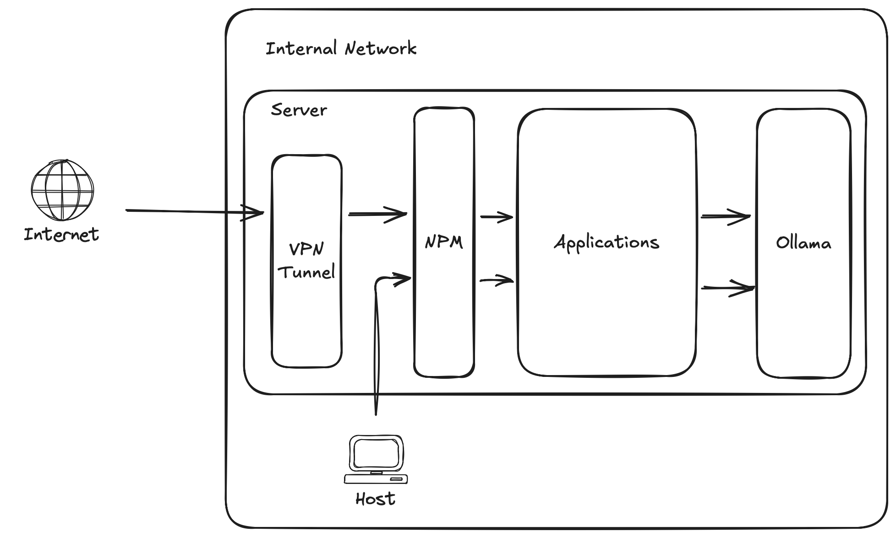

# Self-Hosted Applications (Local Server Setup)

This is one of the project that I am working on. It involves setting up a local server for my home network. The diagram above shows how the different devices are connected to each other. The purpose of this project is to:

- Gain knowledge about setting up and configuring servers.
- Improve my skills in managing internal networks.
- Ensure that all devices in my home network can communicate with each other seamlessly.
- Understand the fundamentals of the OSI model and how it applies to local networks.
- Understand and implement basic connectivity between different docker nodes and containers.
- Understand and implement basic security measures for the server.

## Machine and Technologies Used

- Mac Mini M2 (MacOS)
  - 24GB RAM
  - 512GB SSD 
- [Docker](../setting_up/docker.md)
- [PyEnv](../setting_up/pyenv.md)

### Knowledge Used and Gained

In this project, I have gained knowledge about setting up and configuring servers. I have also improved my skills in managing internal networks. Additionally, I have learned how to ensure that all mobile devices, whether in home or external network, can reach to the applications hosted in the server. I have also understood the fundamentals of the OSI model and how it applies to local networks. Furthermore, I have implemented basic connectivity between different docker nodes and containers. Finally, I have learned how to implement basic security measures for the server.

### Applications Hosted In The Server

- [**Twingate**](twingate.md) -> A secure access solution that allows users to connect to internal resources securely
- [**Nginx Proxy Manager**](npm.md) -> A web-based proxy manager that simplifies the process of setting up and managing reverse proxies
- [**Ollama**](ollama.md) -> An app that hosts various type of AI models, running locally on a server
- [**Openweb UI**](openwebui.md) -> A web-based user interface with various services and function to access and run AI models